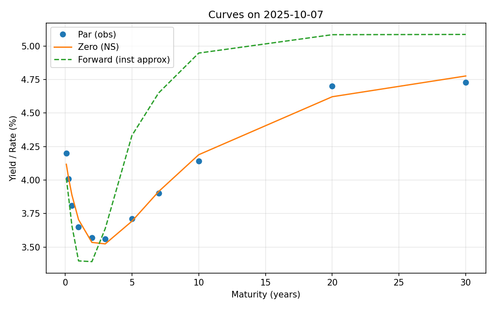

# Yield Curve PCA

Simple analysis of U.S. Treasury constant-maturity yields:
- Fits a Nelson–Siegel curve to the latest date.
- Builds zero and forward curves and saves a comparison plot.
- Runs PCA on the yield history and saves loadings (when enough data).

## Quick Start

1) Ensure data exists at `data/treasury_yields.csv`.
   - Columns may be FRED codes (e.g., `DGS2`, `DGS10`), numeric maturities (e.g., `0.25`, `2`, `10`), or labels like `3M`, `2Y`, `10Y`.
2) Run the script:

```bash
python3 "Yield Curve PCA.py"
```

Figures will be saved under `reports/figures/`.

## Example Output

Latest curves vs observed par points:



If enough rows are present for PCA, you’ll also get:

`reports/figures/pca_loadings.png`

Tip: The script also saves a dated image like `curves_YYYY-MM-DD.png`.
`curves_latest.png` always points to the newest run for the README.

## Development

- `make run`: regenerate figures by running the PCA script.
- `make update`: regenerate, commit updated figures, and push to GitHub.
- `make clean`: remove `reports/figures/curves_latest.png` locally.
